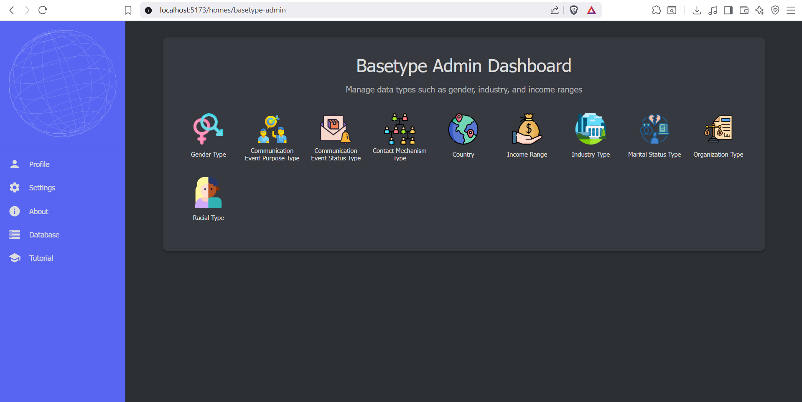
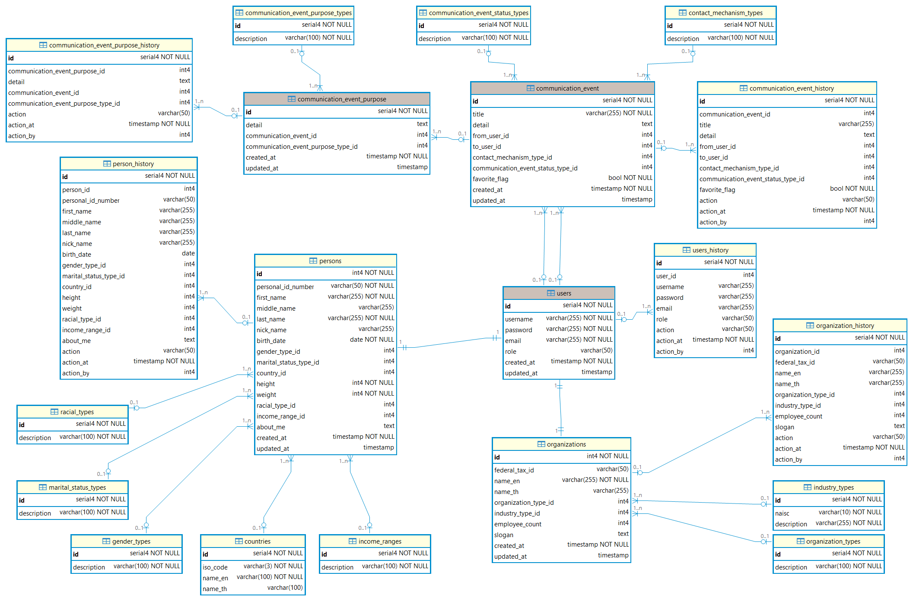

# Party Communication Fullstack Project (Version 5)

## image

## เกี่ยวกับโปรเจกต์ (Project Overview)

**ภาษาไทย:**  
โปรเจกต์จบวิศวกรรมคอมพิวเตอร์ชื่อ "Full Stack Development Based on Reference Data Model" เป็นการพัฒนาแอปพลิเคชันแบบ Full Stack โดยใช้รากฐานจากฐานข้อมูลที่แข็งแกร่ง ออกแบบเป็น Cloud-Native Application ด้วย Docker Container เน้นการพัฒนาแบบ Test-Driven Development (TDD) พร้อมจัดทำ Diagram ที่หลากหลายเพื่ออธิบายโครงสร้างและการทำงานของแอปพลิเคชัน ช่วยให้ผู้พัฒนาคนอื่นเข้าใจและต่อยอดได้ง่าย

**English:**  
The final-year computer engineering project, titled "Full Stack Development Based on Reference Data Model," is a full-stack application built on a robust database foundation. Designed as a Cloud-Native Application using Docker Containers, it emphasizes Test-Driven Development (TDD). The project includes various diagrams to explain the application's structure and functionality, facilitating understanding and further development by other developers.

## การนำเสนอ (Presentation)

[Canva Presentation](https://www.canva.com/design/DAGyK96iYuY/bxd6BUl7wkCyi_EmfIn_4w/edit?utm_content=DAGyK96iYuY&utm_campaign=designshare&utm_medium=link2&utm_source=sharebutton)

# how to run

file you should config for security before run 

    backend\app\config\settings.py

run this to start docker

    docker compose up -d --build

## สัญญาอนุญาต (License)

**ภาษาไทย:**  
โปรเจกต์นี้ใช้สัญญาอนุญาตแบบ Copyleft ผู้ที่นำโค้ดไปพัฒนาต่อต้องเปิดเผย Source Code เพื่อแบ่งปันเทคโนโลยีและร่วมพัฒนานวัตกรรมให้โลกก้าวหน้าต่อไป

**English:**  
This project is licensed under a Copyleft license. Anyone who builds upon this project must share their source code to promote technology sharing and collective advancement.